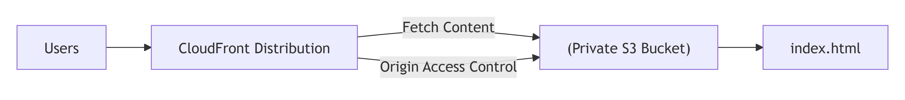

# AWS S3 + CloudFront Static Website Hosting

## Architecture



## Overview

This project provisions a static website hosting infrastructure on AWS using:
- **S3** — stores static files (`index.html`)
- **CloudFront** — CDN, distributes content globally with HTTPS
- **OAC** — Origin Access Control, allows CloudFront to access private S3 bucket

Infrastructure is managed using **Terraform modules**.

---

## Project Structure

```
S3bucket_and_cloudfront/
├── main.tf              → module calls
├── variables.tf         → root variables
├── terraform.tf         → backend + required_providers
├── providers.tf         → AWS provider
├── outputs.tf           → cloudfront URL + bucket name
├── index.html           → static website file
└── modules/
    ├── s3/
    │   ├── main.tf      → S3 bucket, public access block, bucket policy, index.html upload
    │   ├── variables.tf → s3 variables
    │   └── outputs.tf   → bucket_name, bucket_arn, bucket_domain
    └── cloudfront/
        ├── main.tf      → OAC + CloudFront distribution
        ├── variables.tf → cloudfront variables
        └── outputs.tf   → cloudfront_url, cloudfront_arn
```

---

## Prerequisites

- Terraform >= 1.0
- AWS CLI configured (`aws configure`)
- AWS IAM user with permissions:
  - `s3:*`
  - `cloudfront:CreateOriginAccessControl`
  - `cloudfront:CreateDistribution`
  - `cloudfront:GetDistribution`
  - `cloudfront:DeleteDistribution`
  - `cloudfront:UpdateDistribution`

---

## Remote Backend

State file is stored in S3:
```
udaan-batch-11-abhishek-2026/
└── s3-cloudfront/terraform.tfstate
```

---

## Steps to Run

### Step 1 — Initialize
```bash
terraform init
```

### Step 2 — Import existing S3 bucket (if already exists)
```bash
terraform import module.s3.aws_s3_bucket.website mishrajiwale.xyz
```

### Step 3 — Plan
```bash
terraform plan
```

### Step 4 — Apply
```bash
terraform apply
```

### Step 5 — Access website
After apply, output will show CloudFront URL:
```
cloudfront_url = "xxxxxxxx.cloudfront.net"
```

Open in browser → website will be live! ✅

### Step 6 — Destroy
```bash
terraform destroy
```

---

## Resources Created

| Resource | Description |
|----------|-------------|
| `aws_s3_bucket` | Private S3 bucket for static files |
| `aws_s3_bucket_public_access_block` | Block all public access |
| `aws_s3_bucket_policy` | Allow only CloudFront to access bucket |
| `aws_s3_object` | Upload index.html to S3 |
| `aws_cloudfront_origin_access_control` | OAC for secure S3 access |
| `aws_cloudfront_distribution` | CloudFront CDN distribution |

---

## Notes

- S3 bucket is **private** — only CloudFront can access it via OAC
- CloudFront default SSL certificate is used — HTTPS is free
- Custom domain (`mishrajiwale.xyz`) requires ACM certificate in `us-east-1`
- `index.html` is automatically uploaded to S3 on `terraform apply`
